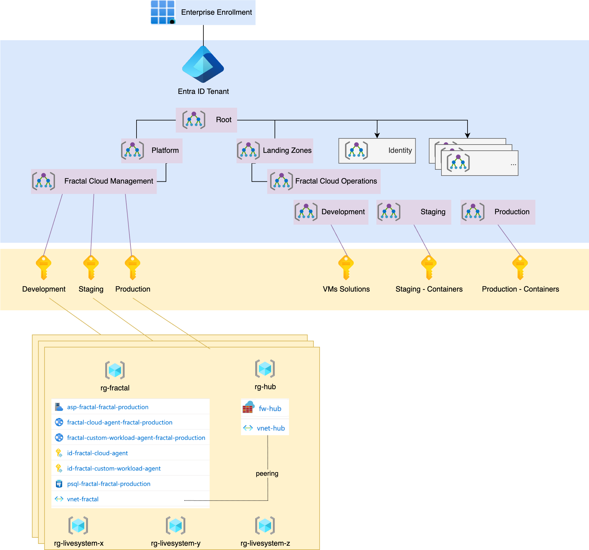

# Quick Start Environments

This sample will help you get started creating your own environments setup, with production and non production environments.
In this sample we have created 2 environments, Production and NonProduction

## Objectives

* Definition of the `environment_deployment` GitHub Action: deploying and initializing the environments
* [Azure CAF](https://learn.microsoft.com/en-us/azure/cloud-adoption-framework/ready/landing-zone/design-areas) adoption
  as per diagram (Hub-and-spoke, management groups, etc.)
* All services are deployed in private mode, communication is only performed through azure private network by peering
  the spokes to the hub, opening the correct firewall rules, and
  using [private links](https://learn.microsoft.com/en-us/azure/private-link/private-link-overview) for storage account
  and postgres sql.
* The `environment_deployment` action creates the following setup:
    * Creation of 2 Fractal Management Environments: NonProduction, Production
    * Each Management Environment has a Fractal Cloud agent to ensure segregation between different environments, as
      shown in the diagram. Each Management Environment will have an Operational Environment, which will contain a
      single Live System (Application) as per our customer's request.
